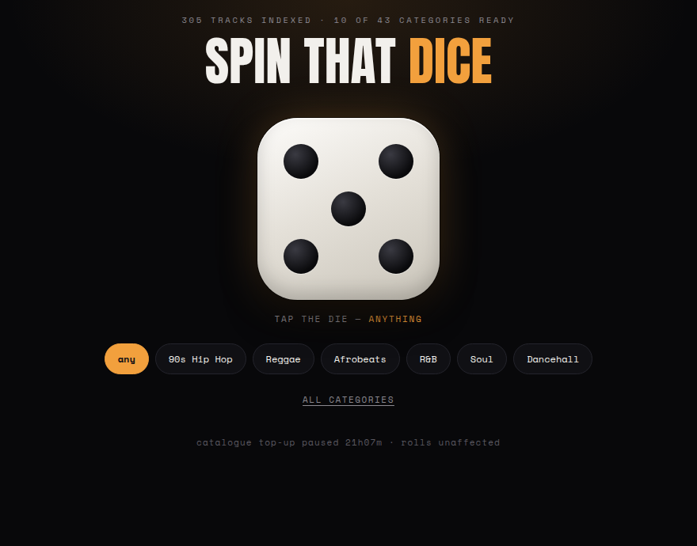

# spin-that-dice

**[Try it →](https://spin-that-dice.cn1-lab.uk)**



A jukebox dice for Black music. Tap the die, get a random track from a category,
and it plays. Built for a tablet propped up at a party — black, one big target,
no menus, no browsing.

The 43 categories are deliberately narrow rather than "every genre on Spotify":
hip hop and UK rap, grime and drill, dancehall, bashment, lovers rock, dub and
soca, afrobeats and afrobeat, amapiano, hiplife and highlife, kwaito, Motown,
northern and southern soul, neo soul, funk, boogie, quiet storm, new jack swing,
gospel, jazz funk, Chicago house, Detroit techno, UK garage and jungle. If you
want punk in there, add it — a category is two lines in
`data/categories.json`.

Rolling **never calls the Spotify API**. A background thread builds a local index
within a strict request budget; the die picks from that. A four-hour party costs
zero API calls, and the index keeps growing between parties.

## Why the index exists

The obvious design — one search request per roll — dies in practice:

- Spotify rate-limits **per app**, not per user, on a rolling window. A busy
  screen exhausts it and takes every other roll down with it.
- Worse, **the quota window re-arms while you are throttled.** Keep calling after
  a 429 and the deadline keeps moving; an open browser tab can hold an app in a
  permanent 429. Measured directly: a `Retry-After` of 82,510s had *grown back*
  toward 24h after further calls.

So this trades freshness for reliability:

| | requests |
|---|---|
| Rolls during a party | **0** |
| Filling one category to 150 tracks | ~15, spread over time |
| Budget ceiling | `SPIN_CALLS_PER_HOUR`, default 60 |

A 429 trips a circuit breaker that honours `Retry-After` and stops calling
entirely until it expires. Rolls keep working the whole time.

## Backends

Spotify is the default, but it is the *worst* source for a dice: no real genres,
a shared quota, and full playback needs every listener to have Premium. Point it
at your own library instead and all three problems disappear.

| `SPIN_PROVIDER` | Works with | Genres | Random track | Playback |
|---|---|---|---|---|
| `spotify` (default) | Spotify | faked from search queries | from a local index | embed, **Premium required** |
| `subsonic` | Navidrome, Airsonic, Gonic, Ampache, LMS | real, from your tags | `getRandomSongs` — one call | your own files |
| `jellyfin` | Jellyfin, Emby | real, from your tags | `sortBy=Random` | your own files |

```bash
SPIN_PROVIDER=subsonic \
SPIN_SUBSONIC_URL=http://nas:4533 \
SPIN_SUBSONIC_USER=you SPIN_SUBSONIC_PASSWORD=... python3 spin.py

SPIN_PROVIDER=jellyfin \
SPIN_JELLYFIN_URL=http://jf:8096 SPIN_JELLYFIN_TOKEN=... python3 spin.py
```

On these backends there is no index, no budget and no crate — the dice is a
single API call, and audio streams through `/api/stream` so your server
credentials never reach the browser and there is no CORS to configure. Subsonic
passwords use salted token auth, never plaintext.

> ⚠️ **Both are unverified against a live server.** They are written to the
> published API specs and covered by offline tests with a stubbed transport, but
> nobody has yet pointed them at a real Navidrome or Jellyfin. Expect to fix
> something the first time you do — and please open an issue when you do.

`providers.Subsonic.jukebox()` also implements Navidrome's jukebox mode, so
audio can come out of the *server's* speakers with the tablet as a control
surface. It is not wired to the UI yet.

## Setup

```bash
git clone https://github.com/casareanderson/spin-that-dice
cd spin-that-dice
pip install requests                      # the only dependency
cp spin.env.example spin.env              # add your Client ID + Secret
python3 spin.py                           # http://localhost:8770
```

Credentials come from **your own** Spotify app
([dashboard](https://developer.spotify.com/dashboard)) — so you get your own
quota, not a shared one. Search uses the client-credentials flow: no login, no
redirect URI, no scopes.

It ships with a curated 305-track crate across 10 categories, so a fresh clone
works offline from the first roll while the other 33 categories fill in.

### Running it properly

```bash
sudo cp -r . /opt/spin-that-dice
sudo cp systemd/spin-that-dice.service /etc/systemd/system/
sudo systemctl enable --now spin-that-dice
```

Put it behind a reverse proxy for TLS. `spin.py` serves the page itself, so a
plain `reverse_proxy 127.0.0.1:8770` is enough.

### On a tablet or phone

- **iPad / iPhone:** Safari → Share → **Add to Home Screen**.
- **Android:** Chrome → menu → **Install app** (a web app manifest ships with it).

Either way it launches full-screen with no browser chrome and holds a screen
wake lock so it won't sleep mid-party.

### Choosing lanes

Tap any number of categories to build the pool, then tap the die — each roll
picks one of your chosen lanes at random. No selection means anything goes. Your
choice is remembered on that device.

## Configuration

| env | default | meaning |
|---|---|---|
| `SPIN_PORT` / `SPIN_HOST` | `8770` / `127.0.0.1` | listen address |
| `SPIN_MARKET` | `GB` | Spotify market for results |
| `SPIN_TARGET` | `150` | tracks to hold per category |
| `SPIN_MAX_OFFSET` | `120` | how deep to paginate (see below) |
| `SPIN_CALLS_PER_HOUR` | `60` | hard ceiling on API requests |
| `SPIN_DATA` / `SPIN_WEB` | `./data` / `./web` | asset locations |

## Result quality

Search results get worse the deeper you page. Of 104 tracks hand-dropped from the
first crate, **42 were 2020+ SEO uploads** that only surface deep in a result set,
so `SPIN_MAX_OFFSET` caps depth at 120 by default.

A pattern filter (`looks_like_filler`) rejects outright content farms - "type
beat" accounts, karaoke, `Various Artists`, artists named after the category.
Measured against that hand-classified set it catches **8% of the junk with zero
false positives** against 92 hand-kept tracks. It is deliberately conservative:
most of what was wrong with the first crate was *genre mismatch*, not spam, and
nothing here can detect that - Spotify removed artist `genres` for
Development Mode apps in Feb 2026.

```bash
python3 -m unittest discover -s tests    # offline, no creds, no network
```

## Categories

43, defined as search queries in `data/categories.json`. Add or replace any of
them by editing that file — nothing else changes.

## Optional: let people use their own Spotify

Set `spotify_client_id` in `config.json` (it is public, not a secret) and add the
page's exact URL as a redirect URI on your Spotify app. A small **Connect
Spotify** link appears; one redirect later, a roll plays on whatever Spotify
device is already awake — the tablet's own Spotify app, a speaker, anything.
Leave the field empty and the link never appears.

It uses **Authorization Code + PKCE**, so no client secret is ever in the page,
and the token lives only in that browser's `localStorage`.

Two constraints come from Spotify, not from this code:

- **The redirect URI must be HTTPS**, with one exception for literal loopback
  `http://127.0.0.1:PORT`. A LAN address like `http://nas:8770` is rejected, so
  serve the page over TLS or run it on the listening machine.
- **Premium is required, and a Development Mode app allows 5 accounts.** Guests
  at a party cannot each log in. That cap is Spotify's and is not liftable
  without Extended Quota approval.

Which is the argument for the self-hosted backends above: no login, no Premium,
no user cap, and autoplay is just `audio.play()`.

## Playback

Uses the [Spotify iFrame
API](https://developer.spotify.com/documentation/embeds/tutorials/using-the-iframe-api)
so a roll can call `play()` — a fresh `<iframe>` per roll has nothing to call.
**Full-length playback needs Spotify Premium, logged in on that device**;
Spotify removed 30-second previews from the API in November 2024, so there is no
longer a free fallback.

## Notes on the Spotify API

Some of this is not in the docs and cost real time to find:

- **Nov 2024** removed `/recommendations`, `/audio-features`, `/audio-analysis`,
  `/related-artists` and 30s previews.
- **Feb 2026** renamed and trimmed: search `limit` capped at **10** (was 50),
  `popularity` stripped, artist `genres` **absent entirely** for Development Mode
  apps, and dev-mode user allowlists cut from 25 to 5.
- Removed endpoints answer **403, not 404** — check the path before blaming scopes.

Sequencing a playlist so it flows is a separate tool:
[setlisted](https://github.com/casareanderson/setlisted).

## Licence

MIT.

---

## The API changes, written up

The November 2024 and February 2026 changes noted above are documented in full
separately — including the response codes that mislead you and what each one actually means:

**[The Spotify API, After the Break →](https://asareanderson.gumroad.com/l/taeoza)** ·
[2-page cheat sheet](https://asareanderson.gumroad.com/l/yigsxw)
