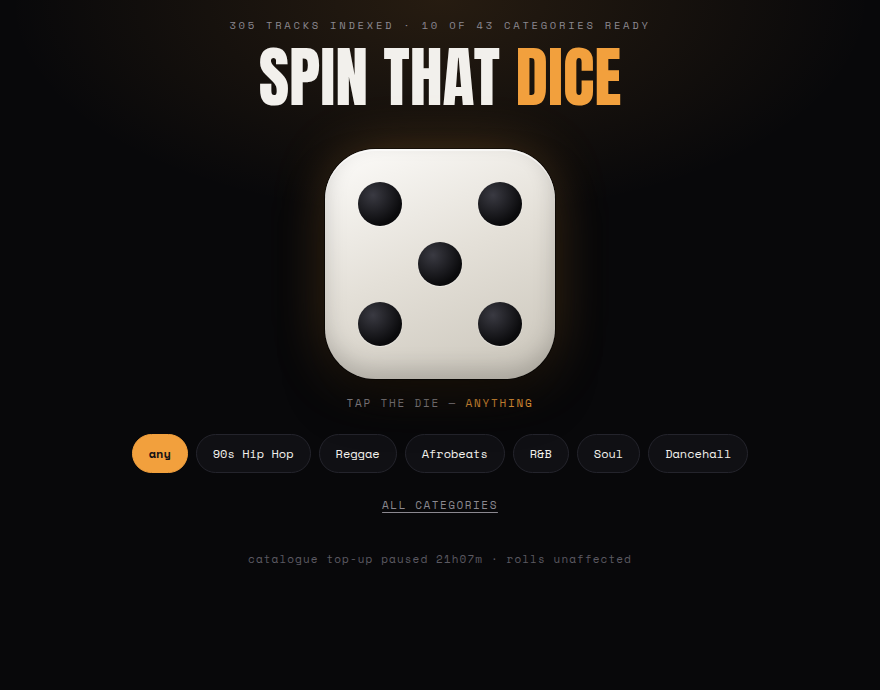
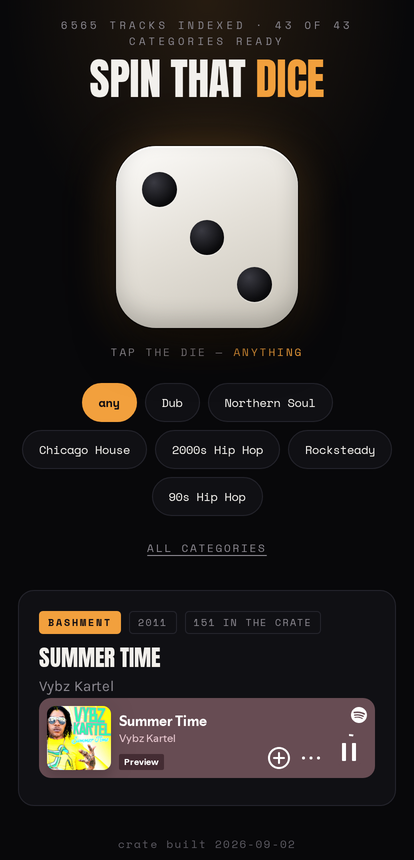
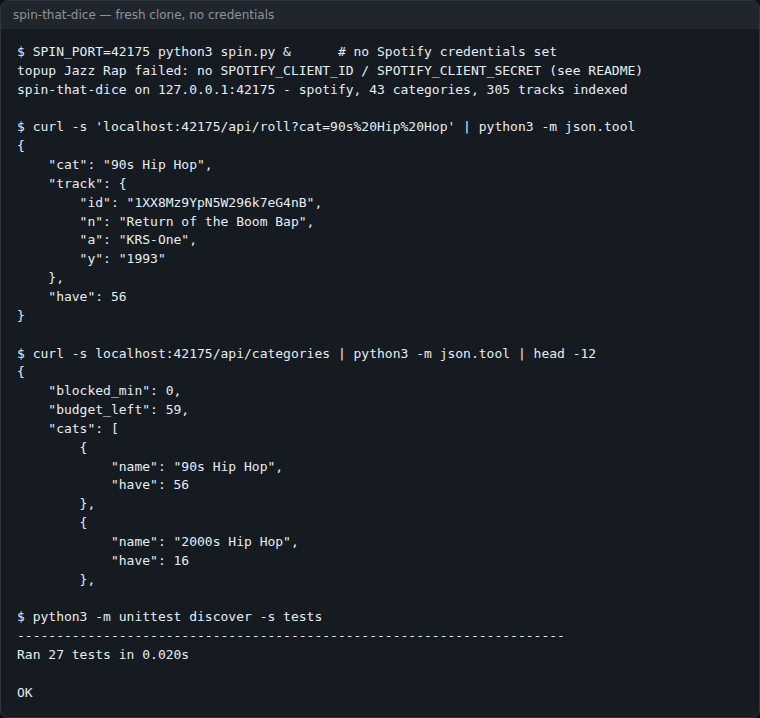
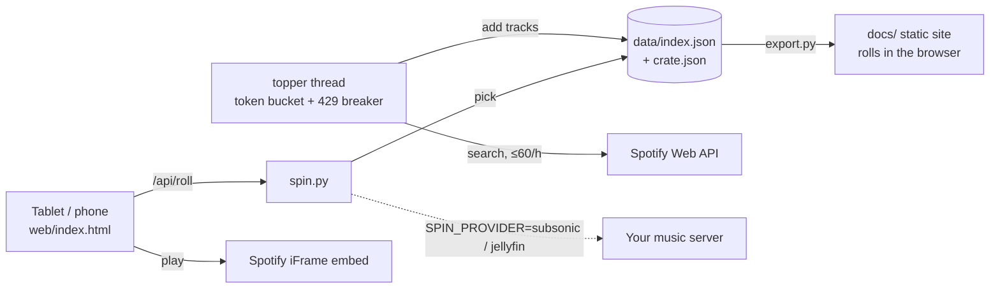

# spin-that-dice

A jukebox dice for Black music: tap the die on a tablet at a party, get a random track from one of 43 categories, and it plays.

**[Try it →](https://spin-that-dice.cn1-lab.uk)**



[](LICENSE)


## Contents

- [What it does](#what-it-does)
- [Screenshots](#screenshots)
- [Quick start](#quick-start)
- [Usage](#usage)
- [Configuration](#configuration)
- [How it works](#how-it-works)
- [Status, limits and real results](#status-limits-and-real-results)
- [Licence and credits](#licence-and-credits)

## What it does

- Picks a random track from a category you choose, or from any category, and plays it in the page.
- Ships 43 deliberately narrow categories in `data/categories.json`: hip hop and UK rap, grime and drill, dancehall, bashment, lovers rock, dub, soca, afrobeats and afrobeat, amapiano, hiplife and highlife, kwaito, Motown, northern and southern soul, neo soul, funk, boogie, quiet storm, new jack swing, gospel, jazz funk, Chicago house, Detroit techno, UK garage and jungle. A category is two lines of JSON.
- Never calls the Spotify API on a roll. A background thread fills a local index within an hourly request budget, and the die picks from that.
- Trips a circuit breaker on a Spotify 429, honours `Retry-After`, and stops calling until it expires. Rolls keep working.
- Plays from your own library instead of Spotify with the `subsonic` (Navidrome, Airsonic, Gonic, Ampache, LMS) or `jellyfin` (Jellyfin, Emby) backends.
- Bakes the index into a static site (`export.py`) that rolls in the browser with no server and no API key.
- Installs as a full-screen web app on iPad, iPhone and Android, and holds a screen wake lock so it doesn't sleep mid-party.

## Screenshots

| After a roll (phone width) | A fresh clone, no credentials |
|---|---|
|  |  |
| The static build from `docs/` (6,565 tracks, 43 of 43 categories), rolled once in headless Chromium. | `spin.py` with no `spin.env`: top-up fails and says why, rolls still come from the shipped crate. |

## Quick start

You need Python 3 and the `requests` package. A Spotify app is optional for the first run.

```bash
git clone https://github.com/casareanderson/spin-that-dice
cd spin-that-dice
pip install requests                      # the only dependency
python3 spin.py                           # http://localhost:8770
```

Success looks like this on stderr:

```
spin-that-dice on 127.0.0.1:8770 - spotify, 43 categories, 305 tracks indexed
```

Open http://localhost:8770 and tap the die. A fresh clone rolls straight away from the shipped 305-track crate (10 of the 43 categories).

To let the other 33 categories fill in, add your own Spotify app's credentials
([dashboard](https://developer.spotify.com/dashboard)), so you get your own quota rather than a shared one:

```bash
cp spin.env.example spin.env              # paste Client ID + Secret
python3 spin.py
```

Search uses the client-credentials flow: no login, no redirect URI, no scopes.

## Usage

### Run it as a service

```bash
sudo cp -r . /opt/spin-that-dice
sudo cp systemd/spin-that-dice.service /etc/systemd/system/
sudo systemctl enable --now spin-that-dice
```

Put it behind a reverse proxy for TLS. `spin.py` serves the page itself, so a plain `reverse_proxy 127.0.0.1:8770` is enough.

### Put it on a tablet or phone

- **iPad / iPhone:** Safari, Share, **Add to Home Screen**.
- **Android:** Chrome, menu, **Install app** (a web app manifest ships with it).

### Choose lanes

Tap any number of categories to build the pool, then tap the die. Each roll picks one of your chosen lanes at random. No selection means anything goes. The choice is remembered on that device (`localStorage`).

### Play from your own library

```bash
SPIN_PROVIDER=subsonic \
SPIN_SUBSONIC_URL=http://nas.example.com:4533 \
SPIN_SUBSONIC_USER=you SPIN_SUBSONIC_PASSWORD=... python3 spin.py

SPIN_PROVIDER=jellyfin \
SPIN_JELLYFIN_URL=http://jellyfin.example.com:8096 SPIN_JELLYFIN_TOKEN=... python3 spin.py
```

On these backends there is no index, no budget and no crate. A roll is one API call, and audio streams through `/api/stream`, so your server credentials never reach the browser and there is no CORS to configure. Subsonic uses salted token auth, never a plaintext password.

| `SPIN_PROVIDER` | Works with | Genres | Random track | Playback |
|---|---|---|---|---|
| `spotify` (default) | Spotify | faked from search queries | from a local index | embed, **Premium required** |
| `subsonic` | Navidrome, Airsonic, Gonic, Ampache, LMS | real, from your tags | `getRandomSongs`, one call | your own files |
| `jellyfin` | Jellyfin, Emby | real, from your tags | `sortBy=Random` | your own files |

### Publish a static copy

```bash
python3 export.py                         # writes ./docs: index.html + index.json
```

The page notices there is no `/api` and rolls from `docs/index.json` in the browser. `republish.sh` re-runs the export and only commits when the tracks themselves have changed, not just the build timestamp.

### Run the tests

```bash
python3 -m unittest discover -s tests    # 27 tests, offline, no creds, no network
```

### Optional: let people use their own Spotify

Set `spotify_client_id` in `config.json` (it is public, not a secret) and add the page's exact URL as a redirect URI on your Spotify app. A **Connect Spotify** link appears. After one redirect, a roll plays on whatever Spotify device is already awake. Leave the field empty and the link never appears.

It uses Authorization Code with PKCE, so no client secret is in the page, and the token lives only in that browser's `localStorage`.

## Configuration

Environment variables, read in `spin.py`, `providers.py` and `export.py`:

| Name | Default | What it does |
|---|---|---|
| `SPIN_HOST` | `127.0.0.1` | Listen address |
| `SPIN_PORT` | `8770` | Listen port |
| `SPIN_PROVIDER` | `spotify` | Backend: `spotify`, `subsonic` or `jellyfin` |
| `SPIN_MARKET` | `GB` | Spotify market for search results |
| `SPIN_TARGET` | `150` | Tracks to hold per category |
| `SPIN_MAX_OFFSET` | `120` | How deep to page into search results (see below) |
| `SPIN_CALLS_PER_HOUR` | `60` | Hard ceiling on Spotify requests per hour |
| `SPIN_DATA` | `./data` | Categories, starter crate and the growing index |
| `SPIN_WEB` | `./web` | The page that `spin.py` serves |
| `SPOTIFY_CLIENT_ID` / `SPOTIFY_CLIENT_SECRET` | none | Spotify app credentials. Read from the environment, then `./spin.env`, then `~/.spin-that-dice.env` |
| `SPIN_SUBSONIC_URL` / `_USER` / `_PASSWORD` | none | Subsonic-compatible server |
| `SPIN_JELLYFIN_URL` / `SPIN_JELLYFIN_TOKEN` | none | Jellyfin or Emby server |
| `SPIN_DOMAIN` | none | `export.py` writes it to `docs/CNAME` when set |

Page settings live in `web/config.json` (`spotify_client_id`, empty by default).

## How it works

The obvious design, one search request per roll, dies in practice:

- Spotify rate-limits **per app**, not per user, on a rolling window. A busy screen exhausts it and takes every other roll down with it.
- **The quota window re-arms while you are throttled.** Keep calling after a 429 and the deadline keeps moving, so an open browser tab can hold an app in a permanent 429. Measured: a `Retry-After` of 82,510 s had grown back toward 24 h after further calls.

So `spin.py` trades freshness for reliability. A token bucket (`Budget`) allows `SPIN_CALLS_PER_HOUR` requests, the `topper` thread fills the thinnest categories first, and a 429 stops all calls until `Retry-After` passes.

| | Requests |
|---|---|
| Rolls during a party | **0** |
| Filling one category to 150 tracks | about 15, spread over time |
| Budget ceiling | `SPIN_CALLS_PER_HOUR`, default 60 |


```mermaid
flowchart LR
    T[Tablet / phone<br>web/index.html] -- "/api/roll" --> S[spin.py]
    S -- pick --> I[(data/index.json<br>+ crate.json)]
    B[topper thread<br>token bucket + 429 breaker] -- "search, ≤60/h" --> SP[Spotify Web API]
    B -- add tracks --> I
    T -- play --> E[Spotify iFrame embed]
    S -. "SPIN_PROVIDER=subsonic / jellyfin" .-> L[Your music server]
    I -- export.py --> D[docs/ static site<br>rolls in the browser]
```

```
spin-that-dice/
├── spin.py               HTTP server, roll API, index, budget, 429 breaker, filler filter
├── providers.py          Subsonic and Jellyfin backends (random track, stream proxy)
├── export.py             bakes the index into a static site in docs/
├── republish.sh          re-exports and commits docs/ only when the tracks changed
├── data/
│   ├── categories.json   43 categories as search queries
│   └── crate.json        305-track starter crate (10 categories)
├── web/                  the page, manifest, icons, config.json
├── docs/                 the published static build (GitHub Pages)
├── systemd/              service unit
└── tests/                27 offline tests
```

## Status, limits and real results

- **Published crate:** 6,565 tracks with 43 of 43 categories populated (`docs/index.json`, built 2026-09-02).
- **Result quality.** Search results get worse the deeper you page. Of 104 tracks hand-dropped from the first crate, 42 were 2020+ SEO uploads that only surface deep in a result set, so `SPIN_MAX_OFFSET` caps depth at 120 by default.
- **Filler filter.** `looks_like_filler` rejects content farms: "type beat" accounts, karaoke, `Various Artists`, artists named after the category. Measured against that hand-classified set it catches 8% of the junk with zero false positives against 92 hand-kept tracks. It is deliberately conservative. Most of what was wrong with the first crate was genre mismatch, and nothing here can detect that, because Spotify removed artist `genres` for Development Mode apps in February 2026.
- **The Subsonic and Jellyfin backends are unverified against a live server.** They are written to the published API specs and covered by offline tests with a stubbed transport. Expect to fix something the first time you point one at a real server, and please open an issue when you do.
- `providers.Subsonic.jukebox()` implements Navidrome's jukebox mode (audio from the server's speakers, tablet as remote). It is not wired to the UI yet.
- **Playback needs Spotify Premium**, logged in on that device. Spotify removed 30-second previews from the API in November 2024, so there is no free fallback.
- **Spotify login limits.** The redirect URI must be HTTPS, except literal loopback `http://127.0.0.1:PORT`, so a LAN address is rejected. A Development Mode app allows 5 accounts, so guests at a party cannot each log in. Both limits are Spotify's. The self-hosted backends avoid all of this.

### Notes on the Spotify API

Some of this is not in the docs and cost real time to find:

- **November 2024** removed `/recommendations`, `/audio-features`, `/audio-analysis`, `/related-artists` and 30 s previews.
- **February 2026** capped search `limit` at 10 (was 50), stripped `popularity`, removed artist `genres` for Development Mode apps, and cut dev-mode user allowlists from 25 to 5.
- Removed endpoints answer **403, not 404**. Check the path before blaming scopes.

The full write-up of these changes: [The Spotify API, After the Break](https://asareanderson.gumroad.com/l/taeoza) and a [2-page cheat sheet](https://asareanderson.gumroad.com/l/yigsxw).

Sequencing a playlist so it flows is a separate tool: [setlisted](https://github.com/casareanderson/setlisted).

## Licence and credits

MIT, see [LICENSE](LICENSE).

- Track metadata and playback come from the [Spotify Web API](https://developer.spotify.com/documentation/web-api) and [iFrame API](https://developer.spotify.com/documentation/embeds/tutorials/using-the-iframe-api), under Spotify's developer terms. The screenshot shows a Spotify embed as it renders on a roll.
- Fonts: Anton, Karla and Space Mono, loaded from Google Fonts (SIL Open Font License).
- HTTP client: [requests](https://github.com/psf/requests) (Apache 2.0).
